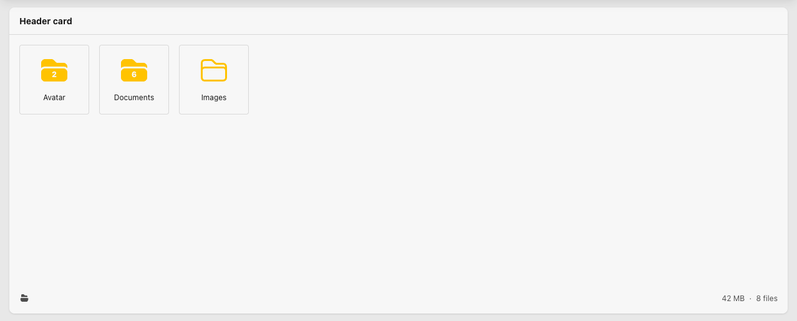

# Spatie Medialibrary Manager
A file manager for Laravel applications using the famous [Spatie Laravel Medialibrary package](https://github.com/spatie/laravel-medialibrary).

**Features**
- Manage multiple media collections via one interactive GUI
- Manage singlefile and multifile collections
- Download, rename or delete media
- Move media between collections
- Manage policies via native Laravel Policies or set policies directly on the component.

## Requirements
- Laravel 12+
- Spatie Medialibrary 11+
- Tailwindcss 4

## Roadmap
We are currently developing the "Pro version" of the manager for customers. We want to publish a free version of the manager here on Github. There are a few things that need to be fixed before we can publish the package.

- [x] Refactor Livewire file structure, eliminate usage of multiple nested Livewire components
- [ ] Make front-end independent of any frameworks / UI component sets 
- [ ] Bug: Tweak file validation to accept only allowed files
- [ ] Bug: Disable "Download All" button if no files are available
- [ ] Bug: Refresh mediaItem if thumb generation is queued
- [ ] Feature: Filesize validation
- [ ] Feature: Policies to set rules for individual collections
- [ ] Feature: Add active folder to url.
- [ ] Feature: Support for single file collections.

The beta version is scheduled for release at the start of May.